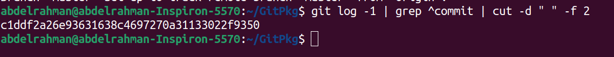
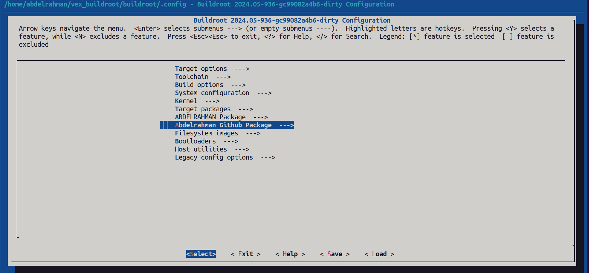
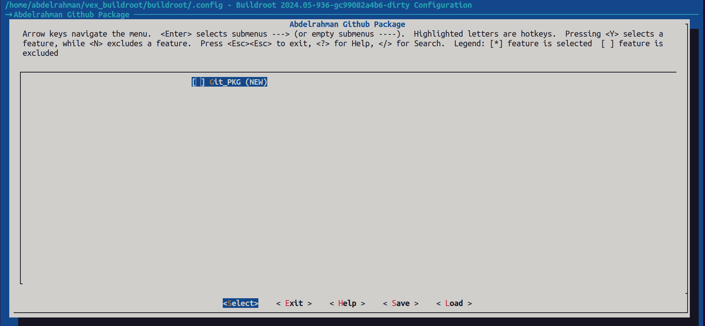
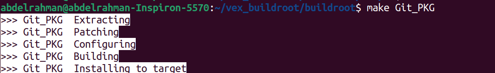

# GitHub Package

**1- create a directory and develop a simple application and a makefile to excute it**
```bash
cd ~
mkdir GitPkg
cd GitPkg
vim myGitapp.c
```
```c
#include <stdio.h>
int main() 
{
    printf("\n***** Hello from Github package *****\n");
    return 0;
}
```
```bash
vim Makefile
```
```bash
TARGET = myGitapp
SRC = myGitapp.c

$(TARGET): $(SRC)
	$(CC) -o $@ $(SRC)

clean:
	-rm -f $(TARGET)
```
**2- create tarball**
```bash
tar -czvf myGitpkg.tar.gz myGitapp.c Makefile
```
**3-**
push to github repository
```bash
git init
git remote add origin 
git add .
git commit -m "Initial commit of Mina Package"
git push -u origin master
```
**4- get the commit ID or Tag**
```bash
git log -1 | grep ^commit | cut -d " " -f 2
```

**5-create a tag**
```bash
git tag v1.0.0
git push origin v1.0.0
```
**6-set the buildroot package**
```bash
cd ~/vex_buildroot/buildroot/packages
mkdir Git_PKG
cd Git_PKG
vim Git_PKG.mk
```
```bash
GITPKG_PACKAGE_VERSION = c1ddf2a26e93631638c4697270a31133022f9350
GITPKG_PACKAGE_SITE = $(call github,abdelrahman420,GitPackage,$(GITPKG_PACKAGE_VERSION))
GITPKG_PACKAGE_LICENSE = GPL-2.0+
GITPKG_PACKAGE_LICENSE_FILES = LICENSE

define GITPKG_PACKAGE_BUILD_CMDS
    $(MAKE) CC="$(TARGET_CC)" LD="$(TARGET_LD)" -C $(@D)
endef

define GITPKG_PACKAGE_INSTALL_TARGET_CMDS
    $(INSTALL) -D -m 0755 $(@D)/myGitapp $(TARGET_DIR)/usr/bin
endef

$(eval $(generic-package))
```
```bash
vim Config.in
```
```bash

config BR2_PACKAGE_GITPKG_PACKAGE
    bool "Git_PKG"
    help
      Githup package.

```
**7- Add the new Config.in in the configuration for buildroot**       
navigate tp package directory
```bash
cd ..
vim Config.in
```
add these lines 
```bash
menu "Abdelrahman Github Package"
    source "package/Git_PKG/Config.in"
endmenu
```
**8- test if the package appears in menuconfig**
```bash
cd ~/vex_buildroot/buildroot
make menuconfig
```


select Git_PKG and type y to enable it then save and exit and type `make Git_PKG` on terminal

**9- excute the script that runs qemu**
```bash
cd ~/vex_buildroot/buildroot/output/images
./start_qemu.sh
```
