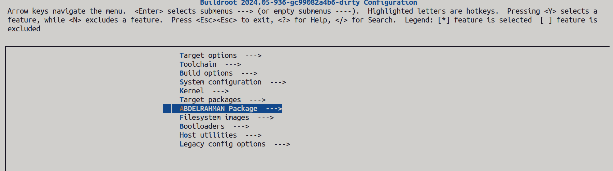
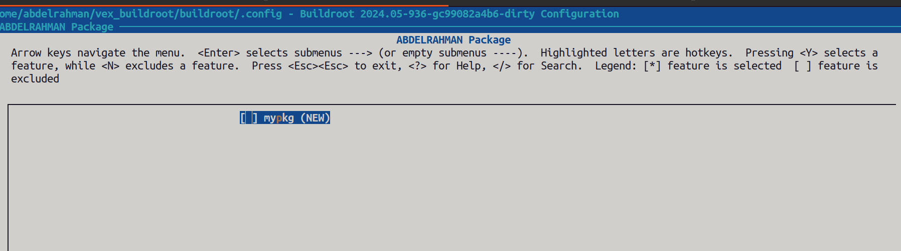
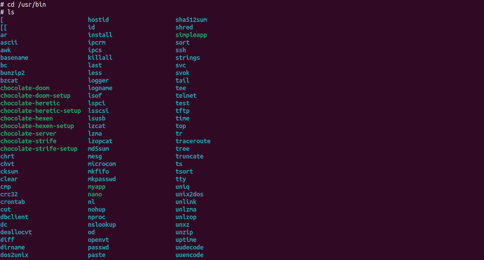
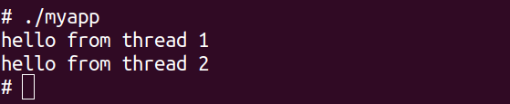

# Buildroot Package

**1- create necessary directory**
```bash
cd ~/vex_buildroot/buildroot/packages
mkdir -p mypkg/src 
```
**2-create my application**
```bash
vim myapp.c
```
```c
#include <stdio.h>
#include <pthread.h>

// Thread function
void* thread_func(void* arg) {
    int x = *(int*)arg;
    printf("hello from thread %d\n", x);
    return NULL;
}

int main() {
    pthread_t thr1, thr2;
    int arg1 = 1, arg2 = 2;

    // Create threads
    pthread_create(&thr1, NULL, thread_func, &arg1);
    pthread_create(&thr2, NULL, thread_func, &arg2);

    // Wait for threads to finish
    pthread_join(thr1, NULL);
    pthread_join(thr2, NULL);

    return 0;
}

```
**3-create makefile**
```bash
vim Makefile
```

```bash
.PHONY: clean
.PHONY: myapp

myapp: myapp.c
        $(CC) -g -Wall $(CFLAGS) $(LDFLAGS) $< -o $@ -pthread

clean:
        -rm -f myapp

```
**4- Create a package definition for this package in the buildroot source tree.**  
navigate to mypkg direcory and create a package definition
```bash
cd ~/vex_buildroot/buildroot/packages/mypkg
vim mypkg.mk
```
```bash
################################################################################
#
# Abdelrahman package
#
################################################################################

MYPKG_VERSION = 1.0
MYPKG_SITE = $(TOPDIR)/package/mypkg/src
MYPKG_SITE_METHOD = local

define MYPKG_BUILD_CMDS
    $(MAKE) CC="$(TARGET_CC)" LD="$(TARGET_LD)" -C $(@D)
endef

define MYPKG_INSTALL_TARGET_CMDS
    $(INSTALL) -D -m 0755 $(@D)/myapp  $(TARGET_DIR)/usr/bin
endef

$(eval $(generic-package))


```
**5- Create the Configuration File for Buildroot**     
inside the mypkg directory create the configuration file
```bash
vim Config.in
```
```bash
config BR2_PACKAGE_MYPKG
    bool "mypkg"
    help
        simple multi-threaded application example.

```
**6- Add the new Config.in in the configuration for buildroot**       
navigate tp package directory
```bash
cd ..
vim Config.in
```
add these lines 
```bash
menu "ABDELRAHMAN Package"
    source "package/mypkg/Config.in"
endmenu
```
**7- test if the package appears in menuconfig**
```bash
cd ~/vex_buildroot/buildroot
make menuconfig
```


select mypkg and type y to enable it then save and exit and type `make` on terminal
**8- excute the script that runs qemu**
```bash
cd ~/vex_buildroot/buildroot/output/images
./start_qemu.sh
```
navigate to `/usr/bin` to excute `myapp`


**9-excute the application**
```bash
./myapp
```

