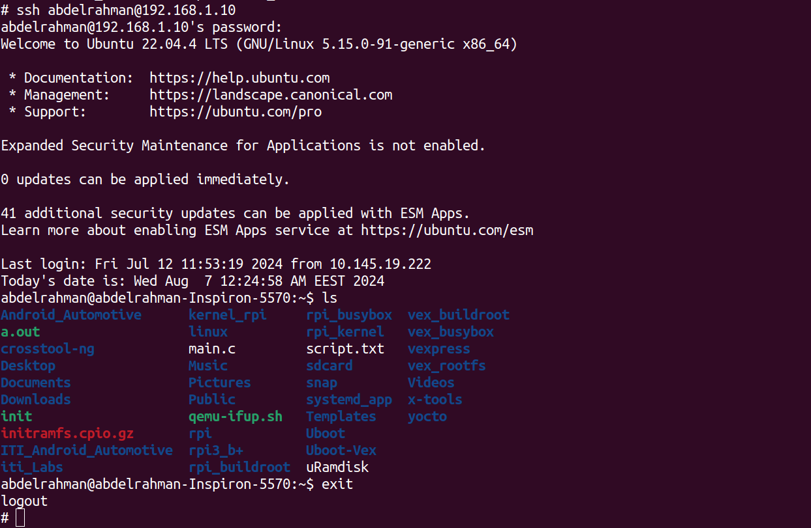
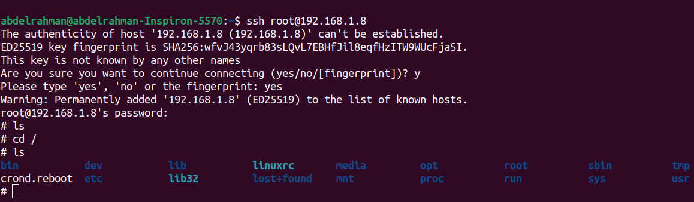

# connecting to qemu through ssh connection

**1- navigate and edit the script that run qemu**
```bash
cd ~/vex_buildroot/buildroot/output/images
vim start_qemu.sh
```
add network interface 
```bash
#!/bin/sh

BINARIES_DIR="${0%/*}/"
# shellcheck disable=SC2164
cd "${BINARIES_DIR}"

mode_serial=false
mode_sys_qemu=false
while [ "$1" ]; do
    case "$1" in
    --serial-only|serial-only) mode_serial=true; shift;;
    --use-system-qemu) mode_sys_qemu=true; shift;;
    --) shift; break;;
    *) echo "unknown option: $1" >&2; exit 1;;
    esac
done

if ${mode_serial}; then
    EXTRA_ARGS='-nographic'
else
    EXTRA_ARGS='-serial stdio'
fi

if ! ${mode_sys_qemu}; then
    export PATH="/home/mina/bulidroot/buildroot/output/host/bin:${PATH}"
fi
### this is the line we edited
exec qemu-system-arm -M vexpress-a9 -smp 1 -m 256 -kernel zImage -dtb vexpress-v2p-ca9.dtb -drive file=rootfs.ext2,if=sd,format=raw -append "console=ttyAMA0,115200 rootwait root=/dev/mmcblk0"  -net nic,model=lan9118 -net tap,script=./qemu-ifup ${EXTRA_ARGS} "$@"
```
qemu-ifup is
```bash
#!/bin/bash
ip a add 192.168.1.10/24 dev $1
ip link set $1 up
```
**2-run qemu**
```bash
./start_qemu.sh
```
**3-add ip in qemu**
```bash
ip add a 192.168.1.8/24  dev eth0
ip link set eth0 up
```
**4-try to connect to host using ssh**
```bash
ssh abdelrahman@192.168.1.10
```

try to do the same but in the host terminal and connect to qemu
```bash
ssh root@192.168.1.8
```



