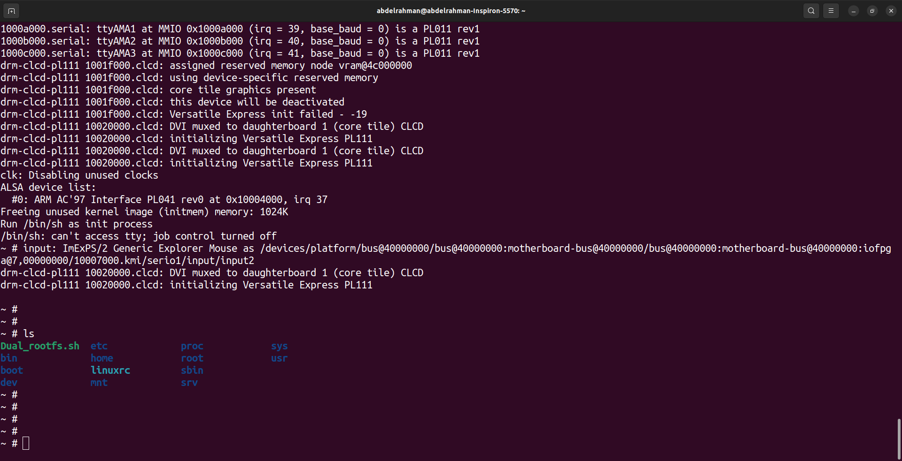
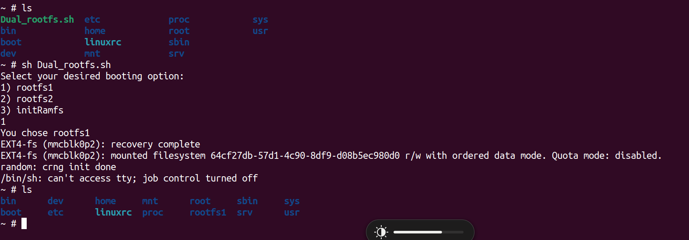

## initramfs

- compress your rootfile system and make image of it to load to ram

    ```bash
    cd ~/rootfs
    find . | cpio -H newc -ov --owner root:root > ../initramfs.cpio
    cd ..
    gzip initramfs.cpio
    mkimage -A arm -O linux -T ramdisk -d initramfs.cpio.gz uRamdisk
    ```

- copy image to your boot partition

    ```bash
    sudo cp uRamdisk ~/sdcard/boot
    ```

- run qemu and edit boot args and boot cmd
    ```bash
    setenv bootargs console=ttyAMA0 rdinit=/bin/sh
    setenv bootcmd fatload mmc 0:1 $kernel_addr_r zImage;fatload mmc 0:1 $fdt_addr_r vexpress-v2p-ca9.dtb;fatload mmc 0:1 $initramfs_addr_r uRamdisk;bootz $kernel_addr_r $initramfs_addr_r $fdt_addr_r

    ```
- reboot qemue


- you are now on initramfs just run the script Dual_rootfs.sh


