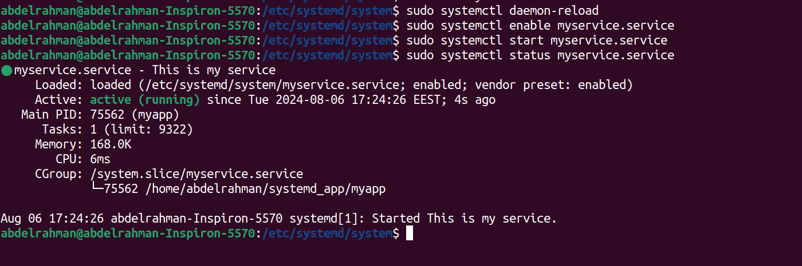
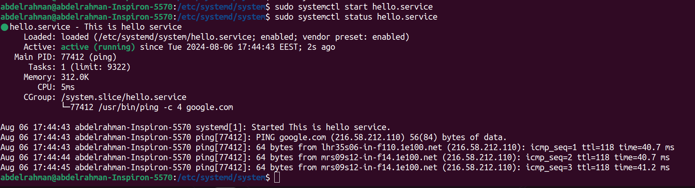
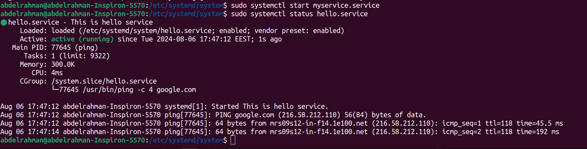

# Managing Services in SystemD

## creating a service 
**1- navigate to systemd  directory and create a sevice**
```bash
cd /etc/systemd/system
sudo touch myservice.service
```
**2- write an application to run when start the service**
```bash
mkdir systemd_app
cd ~/systemd_app
vim myapp.c
```
```c
#include <stdio.h>
#include <unistd.h>
int main() 
{
    while (1)
    {
        printf("Hello from my application 0_0\n");
        sleep(5);
    }

    return 0;
}
```
**3-compile the application**
```bash
gcc myapp.c -o myapp
```
**4-write the service**
```bash
sudo vim myservice.service
```
```bash
[Unit]
Description=This is my service

[Service]
ExecStart=/home/abdelrahman/systemd_app/myapp
Type=simple

[Install]
WantedBy=multi-user.target
```
**5- enable and test the service**
```bash
sudo systemctl daemon-reload
sudo systemctl enable myservice.service
sudo systemctl start myservice.service
sudo systemctl status myservice.service
```


**6- lets create another service**
```bash
sudo vim /etc/systemd/system hello.service
```
```bash
[Unit]
Description=This is hello service

[Service]
ExecStart=/usr/bin/ping -c 4 google.com
Type=simple

[Install]
WantedBy=multi-user.target
```
**7- update `unit` in myservice**
```bash
[Unit]
Description=This is my service
Wants=hello.service
```

**8- enable and test the service**
```bash
sudo systemctl daemon-reload
sudo systemctl start  hello.service
sudo systemctl status hello.service
sudo systemctl enable hello.service
```

**9- lets test services**   
as the myservice depends on hello service when i start it the hello starts automatically



