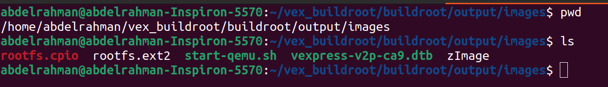
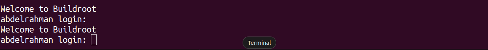
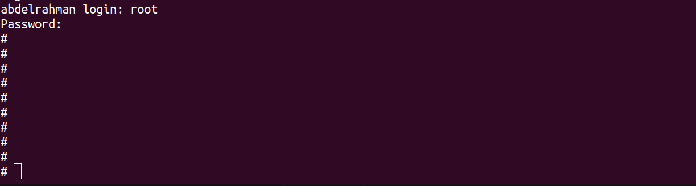
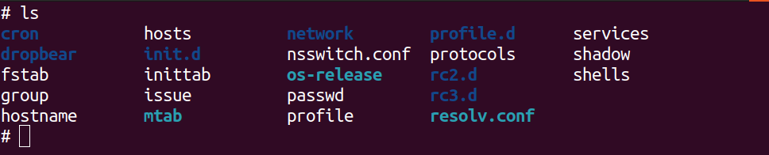
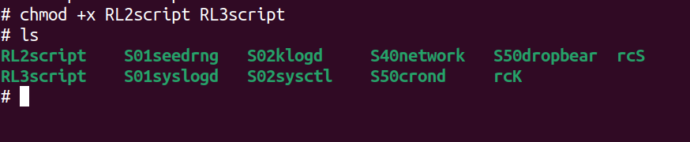
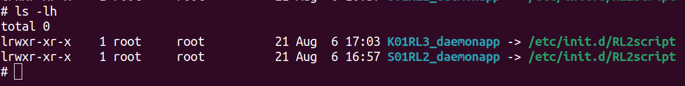
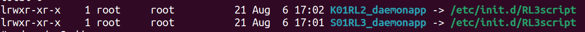
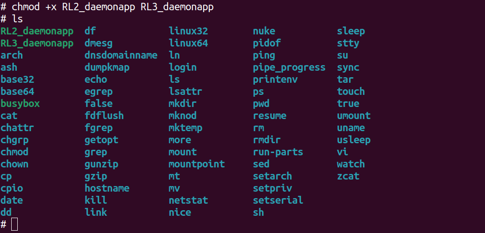
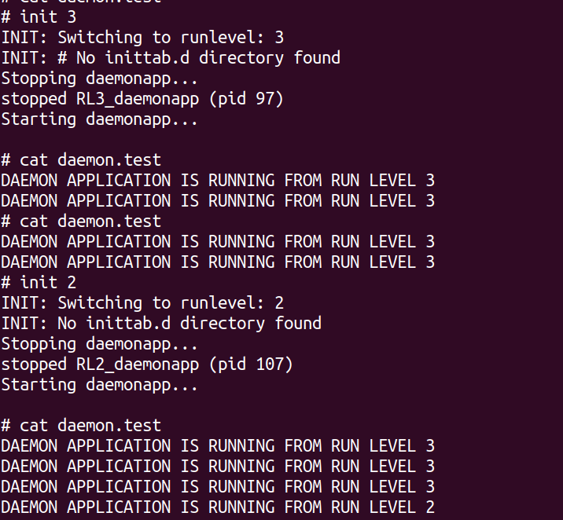

# Customize runlevels for systemV

### 1- run qemu
first we navigate to the build rootdirectory and find the script that starts qemu
```bash
cd ~/vex_buildroot/buildroot/output/image
```

then we run the script
```bash
./start_qemu.sh
```


enter the user and password as you configuered in buildroot configuration then it will login 

### 2-create run levels
create runlevels directories
```bash
cd /etc
mkdir rc2.d rc3.d
```

then create the scripts that start and stop tha application
```bash
vim RL2script
```
```bash
#!/bin/sh
case "$1" in
  start)
       echo "Starting daemonapp..."
       start-stop-daemon -S -n RL2_daempnapp -a /bin/RL2_daemonapp &
       ;;
  stop)
       echo "Stopping daemonapp..."
       start-stop-daemon -K -n RL2_daemonapp -a /bin/RL2_daemonapp
       ;;
  *)
       echo "Usage: $0 {start|stop}"
       exit 1
esac
exit 0


```

```bash 
vim RL3script
```
```bash
#!/bin/sh
case "$1" in
  start)
       echo "Starting daemonapp..."
       start-stop-daemon -S -n RL3_daempnapp -a /bin/RL3_daemonapp &
       ;;
  stop)
       echo "Stopping daemonapp..."
       start-stop-daemon -K -n RL3_daemonapp -a /bin/RL3_daemonapp
       ;;
  *)
       echo "Usage: $0 {start|stop}"
       exit 1
esac
exit 0


```
make scripts excutable
```bash
chmod +x RL2script RL3script
```


## 3- make soft links of this scripts to the directories we created before

**on run level 2 (start daemon of run level 2 , kill daemon of run level 3)**   

```bash
cd rc2.d
ln -s /etc/init.d/RL2script S01RL2_daemonapp.sh
ln -s /etc/init.d/RL2script K01RL3_daemonapp.sh

```


**on run level 3 (start daemon of run level 3, kill daemon of run level 2)**
```bash
cd ../rc3.d
ln -s /etc/init.d/RL3script S01RL3_daemonapp.sh
ln -s /etc/init.d/RL3script K01RL2_daemonapp.sh
```


## 4- create scripts 

```bash
cd /bin
vim my1stScript
```
```bash
#!/bin/sh
while true
do
    echo "Daemonapp is running on level 2" >> /tmp/daemon.txt
    sleep 10
done
```
```bash
vim my2ndScript
```
```bash
#!/bin/sh
while true
do
    echo "Daemonapp is running on level 3" >> /tmp/daemon.txt
    sleep 10
done
```
```bash
chmod +x RL2_daemonapp RL3_daemonapp
```


## 5- write the rc fie that will switch from level to another
```bash
cd /etc/init.d
vim rc
```
```bash

#!/bin/sh
# Check if one argument is provided
if [ $# -ne 1 ]; then
    echo "Usage: $0 <runlevel>"
    exit 1
fi
# Define the folder path based on the argument
folder="rc$1.d"
# Kill scripts starting with K
for i in /etc/$folder/K??* ;do
     # Ignore dangling symlinks (if any).
     [ ! -f "$i" ] && continue
     case "$i" in
        *.sh)
            # Source shell script for speed.
            (
                trap - INT QUIT TSTP
                set stop
                . $i
            )
            ;;
        *)
            # No sh extension, so fork subprocess.
            $i stop
            ;;
    esac
done
# Start scripts starting with S
for i in /etc/$folder/S??* ;do
     # Ignore dangling symlinks (if any).
     [ ! -f "$i" ] && continue
     case "$i" in
        *.sh)
            # Source shell script for speed.
            (
                trap - INT QUIT TSTP
                set start
                . $i
            )
            ;;
        *)
            # No sh extension, so fork subprocess.
            $i start
            ;;
    esac
done

```
```bash
chmod +x rc
```
## 6- modify inittab file

add those lines
```bash
rc2:2:wait:/etc/init.d/rc 2
rc3:3:wait:/etc/init.d/rc 3
```
## 7- now we should test scripts




