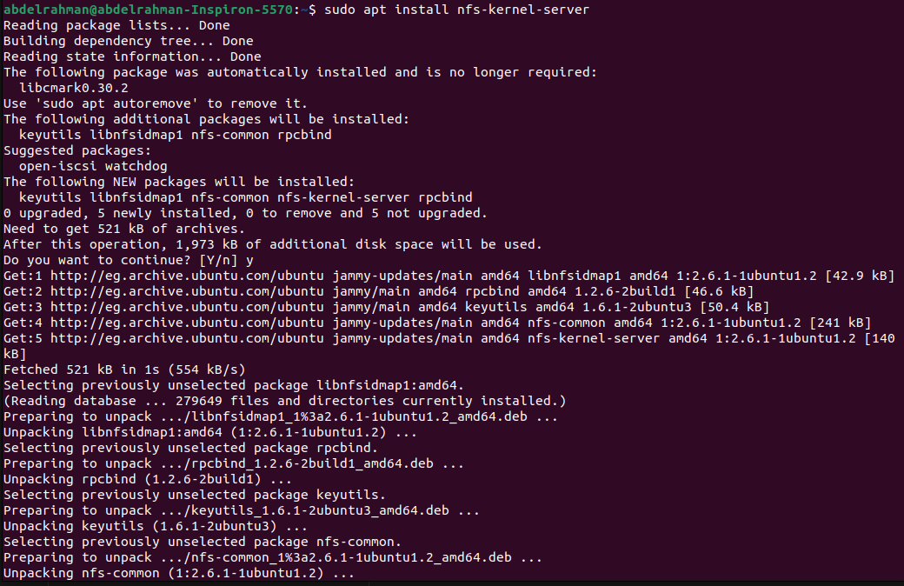
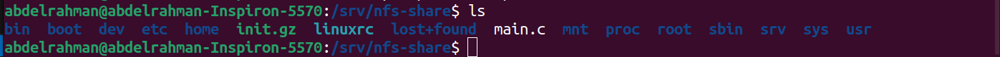
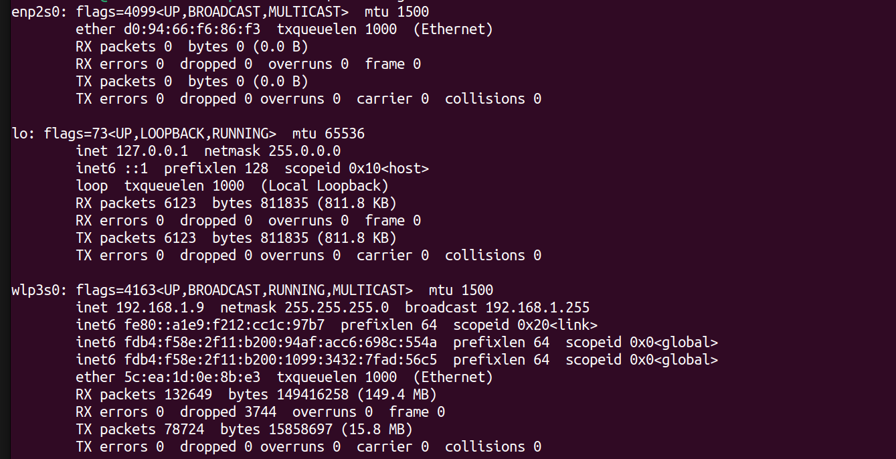
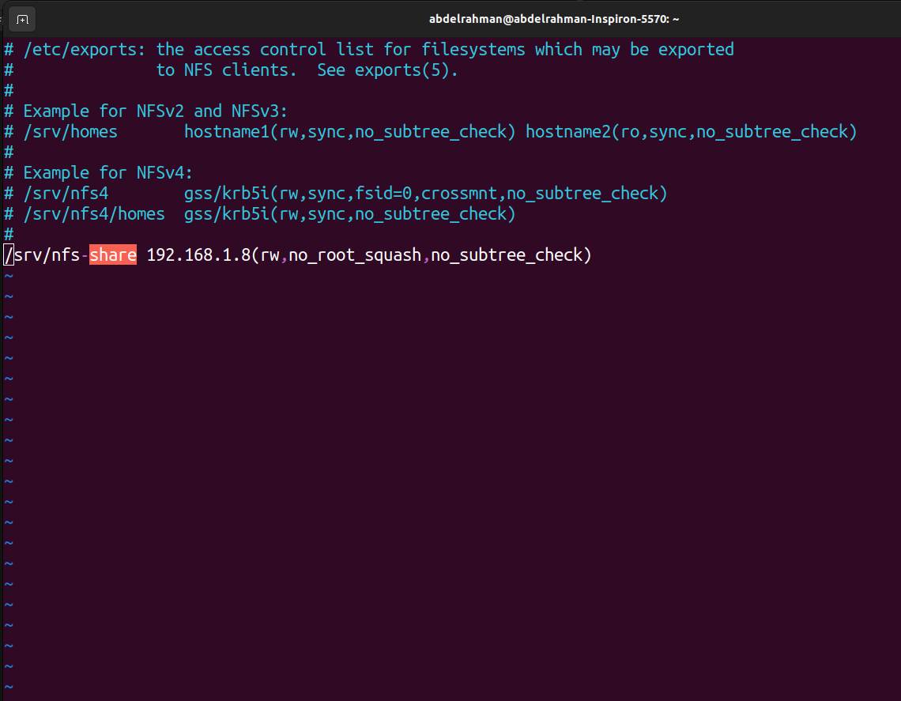
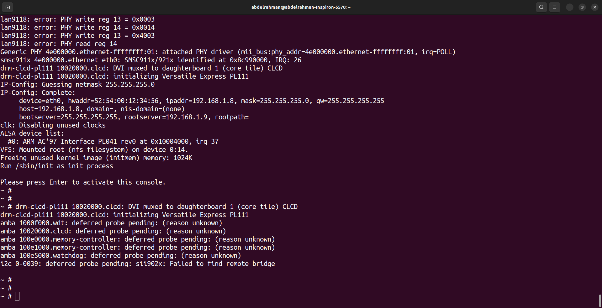

# load rootfs using NFS

## Table of Contents
- [nfs](#nfs)
- [rootfs](#rootfs)
- [qemu](#qemu)


## nfs
- install nfs server 
    ```bash
    sudo apt install nfs-kernel-server
    ```
    
- checking nfs is installed correctly
    ```bash
    systemctl status nfs-kernel-server
    ```
## rootfs
- make a directory that will have the rootfs 
    ```bash
    sudo mkdir /srv/nfs-share
    ```
- copy the rootfs from our virtual sd to that directory

    ```bash
    sudo cp -rp ~/sdcard/rootfs/* /srv/nfs-share
    ```
    

- check your ipaddress
    ```bash
    ifconfig
    ```
    
- choose qemu ip address to match same network
ex:192.168.1.8

- configure nfs file `/etc/exports`
    ```bash
    sudo vim /etc/exports
    ```
- add this line
    ```bash
    /srv/nfs-share 192.168.1.8(rw,no_root_squash,no_subtree_check)
    ```
    

- restart nfs server
    ```bash
    sudo systemctl restart nfs-kernel-server
    ```

## Qemu
- open qemu
    ```bash
    sudo qemu-system-arm -M vexpress-a9 -nographic -sd ~/sdcard/sd.img -net tap,script=./qemu-ifup.sh -net nic -kernel ~/Uboot-Vex/u-boot/u-boot
    ```
- set serverip and clientip
    ```bash
    setenv serverip 192.168.1.9
    setenv ipaddr 192.168.1.8
    ```
- set addresses to load zimage and dtb 
    ```bash
    setenv zimag_addr 0x60000000
    setenv fdt_addr 0x60600000
    ```
- edit bootargs and bootcmd
    ```bash
    editenv bootcmd tftp $zimage_addr vexpress/zImage;tftp $fdt_addr vexpress/vexpress-v2p-ca9.dtb;bootz $zimage_addr - $fdt_addr
    
    editenv bootargs console=ttyAMA0  root=/dev/nfs ip=192.168.1.8:::::eth0 nfsroot=192.168.1.9:/srv/nfs-share,nfsvers=3,tcp rw init=/sbin/init 
    ```
- reboot
