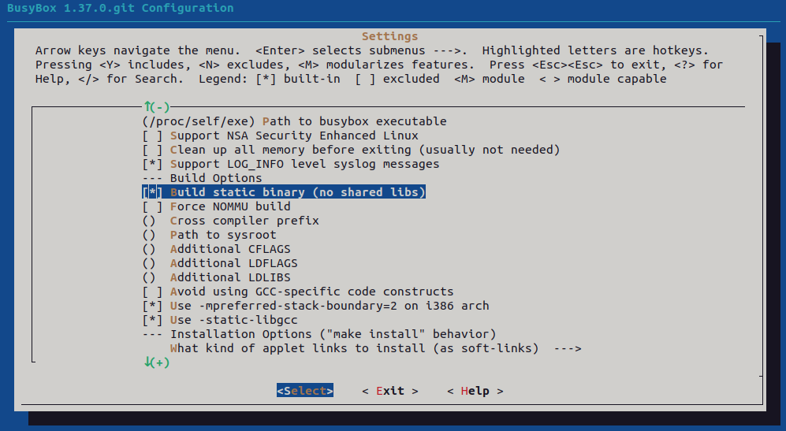
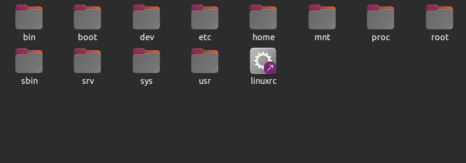
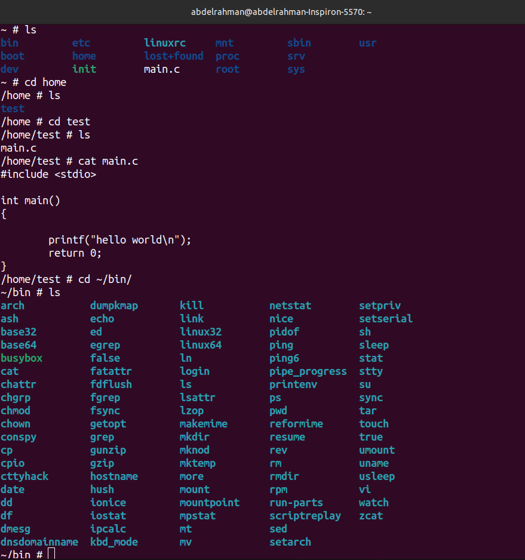

# Load RootFS using Sdcard
## Table of Contents
- [Busybox](#busybox)
- [Creating rootfs](#create_rootfs)
- [SD card](#sdcard)
- [running qemu](#Qemu)

## busybox

- clone the busybox repository
    ```bash
    git clone git://busybox.net/busybox.git  --depth=1
    cd busyBox
    ```
- configure busybox
    ```bash
    export ARCH=arm
    export CROSS_COMPILE=path/toyour/compiler
    make menuconfig
    ```
-  from menuconfig choose settings and navigate to build options and check yes on build static binary 

- build busybox
    ```bash
    make 
    make install
    ```
- after that a folder is generated `_install` wich contains 
`bin`,`sbin` and `usr` directories

## create_rootfs
- make a directory of your rootfile system and copy the `_install` directory contents in it
    ```bash
    mkdir rootfs_static #as we built bysybox statically
    cp -rp ~/vex_busybox/busybox/_install/*  ~/vex_rootfs/rootfs_static
    ```
- make the athor directories needed for the rootfs
    ```bash
    cd ~/vex_rootfs/rootfs_static
    mkdir boot dev etc home mnt proc root srv sys
    ```
    
- create the rcS script
    ```bash
    sudo mkdir etc/init.d
    sudo vim etc/init.d/rcS
    ```
    ```bash
    #!/bin/sh
    # mount a filesystem of type `proc` to /proc
    mount -t proc nodev /proc
    # mount a filesystem of type `sysfs` to /sys
    mount -t sysfs nodev /sys
    # mount devtmpfs if you forget to configure it in Kernel menuconfig
    mount -t devtmpfs devtempfs /dev
    ```
    ```bash
    sudo chmod +x etc/init.d/rcS
    ```
- create the tab file
    ```bash
    sudo vim etc/inittab
    ```
    ```bash
    # inittab file 
    #-------------------------------------------------------
    #When system startup,will execute "rcS" script
    ::sysinit:/etc/init.d/rcS
    #Start"askfirst" shell on the console (Ask the user firslty to press any key) 
    ttyAMA0::askfirst:-/bin/sh
    #when restarting the init process,will execute "init" 
    ::restart:/sbin/init
    ```
## sdcard
- mount virtual sd card
    ```bash
    sudo losetup -f --show --partscan sd.img
    sudo mount /dev/loop27p1 ~/sdcard/boot/
    sudo mount /dev/loop27p2 ~/sdcard/rootfs/
    ```
- copy all files from rootfs directory to the rootfs partition in the virtiual sdcard

    ```bash
    cp -rp ~/vex_rootfs/rootfs_static/* ~/sdcard/rootfs
    ```
## Qemu
- run qemu 
    ```bash
    sudo qemu-system-arm -M vexpress-a9 -nographic -sd ~/sdcard/sd.img -net tap,script=./qemu-ifup.sh -net nic -kernel ~/Uboot-Vex/u-boot/u-boot
    ```
- setting kernel and device tree addresses
    ```bash
    setenv kernel_addr_r 0x60100000
    setenv fdt_addr_r 0x60000000
    ```
- setting `bootargs` and bootcmd

    ```bash
    setenv bootargs 'console=ttyAMA0 root=/dev/mmcblk0p2 rootfstype=ext4 rw rootwait init=/sbin/init'
    setenv bootcmd 'fatload mmc 0:1 $kernel_addr_r zImage;fatload mmc 0:1 $fdt_addr_r vexpress-v2p-ca9.d;bootz $kernel_addr_r - $fdt_addr_r;

    saveenv
    ```
- reseting qemu by writing `reset` in the uboot shell
the image is oaded and this is the output after trying some commands

