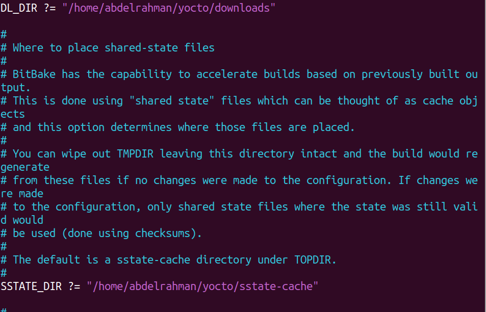
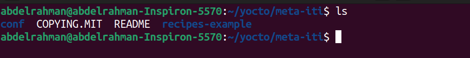
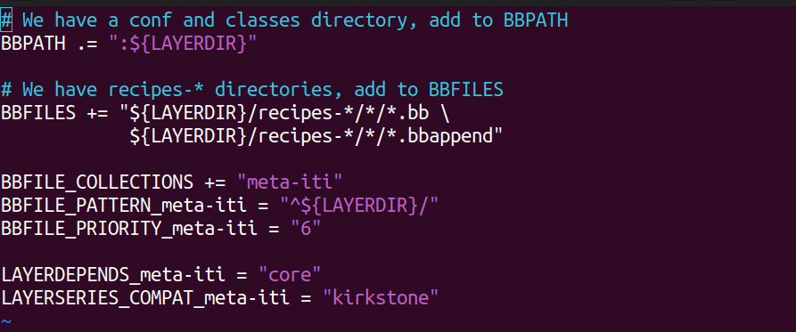
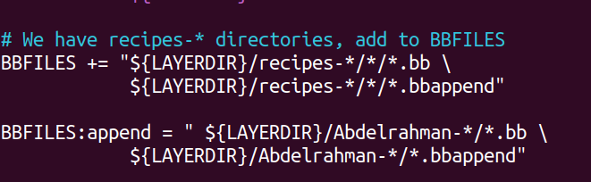
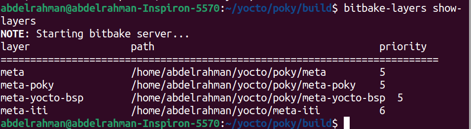
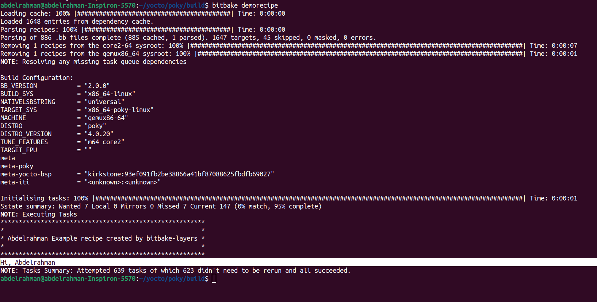

# Creating Layer in Yocto and editing recipe

## 1- setting up yocto environment

- 1- make a directory for yocto 
    ```bash
    mkdir yocto && cd yocto
    ``` 
- 2- clone poky and select suitable branch we chose `kirkstone`
    ```bash
    git clone -b kirkstone git://git.yoctoproject.org/poky.git
    cd poky
    ```
- 3- configure `poky`   
    ```bash
    source oe-init-build-env 
    cd conf
    vim local.com
    ```
- 4-edit these variables
    ```bash
    DL_DIR ?= "/home/abdelrahman/yocto/downloads"
    SSTATE_DIR ?= "/home/abdelrahman/yocto/sstate-cache"
    ```
    

- 5- then build yocto it will take a while to complete
    ```bash
    bitbake -k core-image-minimal
    ```
## 2- creating our own layer
we will create a layer in `yocto` directory called `meta-iti`
- 1-make sure you are in poky directory 

- 2- use command `bitbake-layers` to create a layer and give it option `create-layer` and the path of layer with its name
    ```bash
    bitbake-layers create-layer ../../meta-iti 
    ```
- 3- the layer is created if we navigate in the layer we will see


## 3- edit on the demo recipe that is created

- 1- if we navigate to `conf` directory we will find a file called layer.conf this file have the layer configuration lets explain important variables in it


    **BBPATH**  :the path of the layer
    **BBFILES** :the recipe files.
    this variable searches for recipes in a certain directory only as it appears but we will append on this file to make him search in a directory of our own
    !
    **BBFILE_COLLECTIONS** : the name of the layer
    **BBFILE_PATTERN_meta-iti** 
    **BBFILE_PRIORITY_meta-iti** : the protrity of the layer
    **LAYERDEPENDS_meta-iti** : the layer dependencies in our case its another layer called core 
    **LAYERSERIES_COMPAT_meta-iti** : the compatapility of layer in our case its `kirkstone` as we chose while cloning
- 2- add a variable to the `layer.conf` file
    ```bash
      # We have a conf and classes directory, add to BBPATH
    BBPATH .= ":${LAYERDIR}"

    # We have recipes-* directories, add to BBFILES
    BBFILES += "${LAYERDIR}/recipes-*/*/*.bb \
                ${LAYERDIR}/recipes-*/*/*.bbappend"

    BBFILES:append = " ${LAYERDIR}/Abdelrahman-*/*.bb \
                ${LAYERDIR}/Abdelrahman-*/*.bbappend"

    BBFILE_COLLECTIONS += "meta-iti"
    BBFILE_PATTERN_meta-iti = "^${LAYERDIR}/"
    BBFILE_PRIORITY_meta-iti = "6"

    LAYERDEPENDS_meta-iti = "core"
    LAYERSERIES_COMPAT_meta-iti = "kirkstone"

    #The variabe that will be checked on in recipe 
    MY_VAR ?= "1"


    ```
- 3-create a directory in `meta-iti` called Abdelrahman-examples
    ```bash
    cd ~/yocto/poky/meta-iti
    mkdir Abdelrahman-examples
    cd Abdelrahman-examples
    ```
- 4- copy the example recipe that is created when creating the layer to the `Abdelrahman-examples` directory and rename it 
    ```bash
    cp recipes-example/example/example_0.1.bb .
    mv example_0.1.bb demorecipe_1.0.bb
    ```
- 5- edit this recipe
    ```bash
    SUMMARY = "bitbake-layers recipe"
    DESCRIPTION = "Recipe created by bitbake-layers"
    LICENSE = "MIT"

    python do_display_banner() {
        bb.plain("***********************************************");
        bb.plain("*                                             *");
        bb.plain("*  Example recipe created by Abdelrahman      *");
        bb.plain("*                                             *");
        bb.plain("***********************************************");

    var_value = d.getVar('MY_VAR')
        if var_valu == "0":
            bb.plain("Hi Abdelrahman")
        elif var_valu == "1":
            bb.plain("Hello Abdelrahman")
    }

    addtask display_banner before do_build

    ```
## 4- Add the created layer
- 1- make sure you are in poky directory 
    ```bash
    cd ~/yocto/poky
    ```
- 2- run this command
    ```bash
    source oe-init-build-env
    ```
- 3- then add your layer
    ```bash
    bitbake-layers add-layer ../../meta-iti/
    ```
- 4- check if your layer is added 
    ```bash
    bitbake-layers show-layers
    ```
    

## 6- test the recipe
- 1- make sure you are in poky directory 
    ```bash
    cd ~/yocto/poky
    ```
- 2- run this command
    ```bash
    source oe-init-build-env
    ```
- 3- build the recipe
    ```bash
    bitbake demorecipe
    ```
    