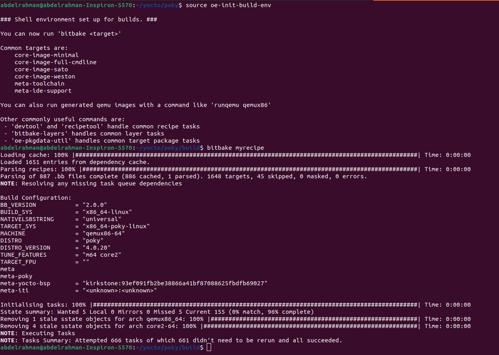
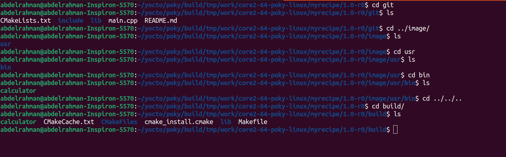

# Cloning DemoApp on git using recipe

## 1-create myrecipe
```bash
cd ~/yocto/meta-iti/Abdelrahman-recipes
vim myrecipemyrecipe_1.0_r0.bb
```
```bash
SUMMARY = "demo recipe"
DESCRIPTION = "Recipe created by Abdelrahman"


LICENSE = "MIT"
LIC_FILES_CHKSUM = "file://${COMMON_LICENSE_DIR}/MIT;md5=0835ade698e0bcf8506ecda2f7b4f302"

SRC_URI = "git://github.com/FadyKhalil/DemoApp.git;protocol=https;branch=main"
SRCREV = "720c663c5fd7246b4b42c5205d74db7d9784b5b2"

S = "${WORKDIR}/git"

inherit cmake

do_configure() {
    cmake -S ${S} -B ${B}
}

do_compile() {
    oe_runmake -C ${B}
}

do_install() {
    install -d ${D}${bindir}
    install -m 0755 ${B}/calculator ${D}${bindir}
```

## 2-build the recipe
```bash
cd ~/yocto/poky
source oe-source oe-init-build-env
bitbake myrecipe
```


## 3-Check Output

